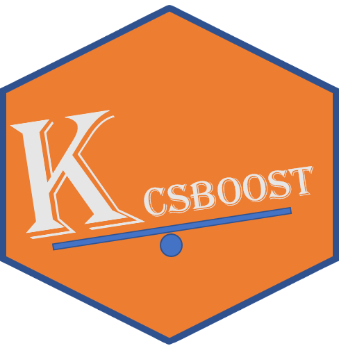

# Kcsboost 
<!--[]()
[]()
[]()
[]()-->

## Overview
### CostSensitiveLearning

Cost-sensitive learning to address class imbalance and misclassification cost in a multiclass setting using lasso regularized logistic regression and gradient boosted decision trees.

## Install the development version from GitHub :

``` r
# install.packages("devtools")
devtools::install_github("KipedeneCoulibaly/Kcsboost")
```
